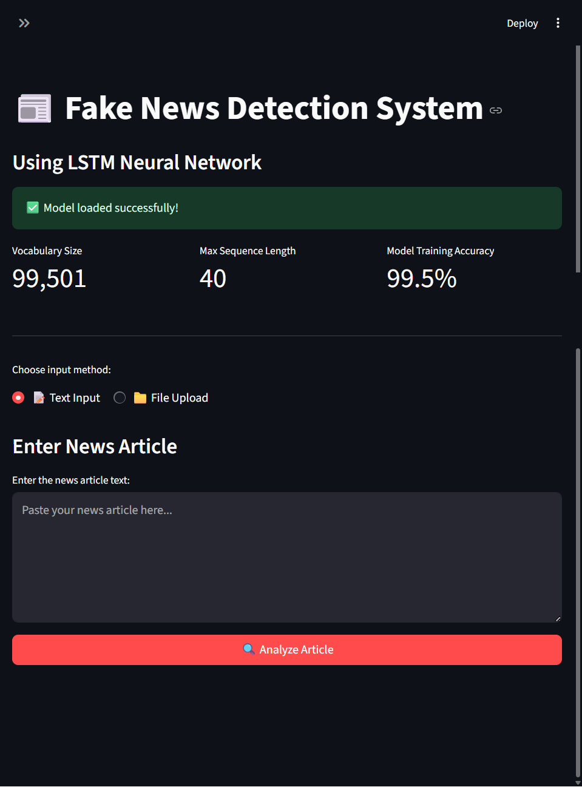
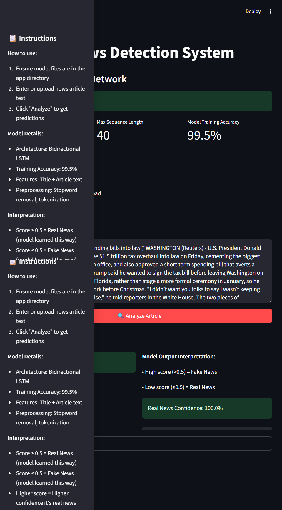

# Fake News Detection using Bidirectional LSTM

## Project Overview
A deep learning project demonstrating text classification using Natural Language Processing and Bidirectional LSTM neural networks to classify news articles as **Real** or **Fake**.


## 📸 Demo

### Home Page


### Sidebar


### Fake News Sample


### Real News Sample


## 🎯 Features
- **Bidirectional LSTM Architecture**: Captures context from both directions in text
- **Text Preprocessing Pipeline**: Tokenization, stopword removal, padding
- **Word Embeddings**: 128-dimensional embedding layer for semantic understanding
- **Data Visualization**: Word clouds and distribution analysis
- **Streamlit Web App**: Interactive interface for testing the model
- **Model Persistence**: Saved trained model and tokenizer
- **Hugging Face Integration**: Model automatically downloaded from Hugging Face Hub

## 🎯 Tech Stack
- **Python 3.x**
- **TensorFlow/Keras** - Deep learning framework
- **NLTK** - Natural language processing
- **Pandas & NumPy** - Data manipulation
- **Matplotlib & Seaborn** - Data visualization
- **WordCloud** - Text visualization
- **Streamlit** - Web app framework
- **Hugging Face Hub** - Model hosting and distribution

## 📁 Dataset & Model Files

### Pre-trained Model
The trained model is hosted on **Hugging Face** and will be automatically downloaded when you run the app:
- **Model Repository**: [amaluu/fakenewsdetection](https://huggingface.co/amaluu/fakenewsdetection)
- **Model File**: `fake_news_model.keras` (automatically downloaded)

### Dataset (Optional for Training)
If you want to retrain the model or explore the data, you can download the dataset from:
- **Source**: [Kaggle - Fake and Real News Dataset](https://www.kaggle.com/datasets/clmentbisaillon/fake-and-real-news-dataset)
- **Files**: `Fake.csv` and `True.csv`

*Note: The dataset is not required to run the Streamlit app, only for training/analysis. The model is specifically trained and accurate only for these particular Fake.csv and True.csv datasets.*

## 🎯 Model Architecture
```
Sequential Model:
├── Embedding Layer (vocab_size → 128 dimensions)
├── Bidirectional LSTM (128 units)
├── Dense Layer (128 units, ReLU activation)
└── Output Layer (1 unit, Sigmoid activation)

Total Parameters: ~2.8M
Optimizer: Adam
Loss: Binary Crossentropy
```

## 🎯 Installation & Setup

### Prerequisites
```bash
pip install -r requirements.txt
```

Or install manually:
```bash
pip install tensorflow pandas numpy matplotlib seaborn nltk wordcloud streamlit scikit-learn plotly huggingface_hub
```

### Download NLTK Data
```python
import nltk
nltk.download('punkt')
nltk.download('stopwords')
```

## 🚀 Usage

### 1. Clone the Repository
```bash
git clone https://github.com/amalluu/fakenews_detection_model
cd fakenews_detection_model
```

### 2. Run the Streamlit App (Recommended)
```bash
streamlit run app.py
```
The model will be automatically downloaded from Hugging Face on first run.

### 3. Run the Jupyter Notebook (Optional - for training/analysis)
Download `Fake.csv` and `True.csv` from Kaggle, then:
```bash
jupyter notebook FAKENEWSDETECTIONMODELLSTM.ipynb
```

### 4. For Custom Predictions
```python
from tensorflow.keras.models import load_model
import pickle

# Load saved model and tokenizer
model = load_model('fake_news_model.keras')
with open('tokenizer_new.pkl', 'rb') as f:
    tokenizer = pickle.load(f)
```

## 📈 Model Performance
- **Training Accuracy**: 99.8% on the specific Fake.csv and True.csv dataset
- **Validation Split**: 10% of training data
- **Epochs**: 2 (quick convergence due to dataset characteristics)
- **Batch Size**: 64

**Important Limitations:**
- Model achieved 99.8% accuracy specifically on the Fake.csv and True.csv dataset used for training
- May not generalize well to other news sources or datasets
- Preprocessing is aggressive (removes words ≤ 3 characters)
- Uses only first 40 words of articles
- Designed for educational/demonstration purposes

## 📊 What's Included
- **Data Analysis**: Distribution of news by categories
- **Visualizations**: Word clouds for real vs fake news
- **Text Processing**: Length distribution analysis
- **Model Training**: Complete LSTM implementation
- **Web Interface**: Streamlit app with automatic model download
- **Hugging Face Integration**: Seamless model deployment and distribution

## 📝 Project Structure
```
fakenews_detection_model/
├── FAKENEWSDETECTIONMODELLSTM copy.ipynb  # Main training notebook
├── app.py                                 # Streamlit web app
├── tokenizer_new.pkl                      # Fitted tokenizer
├── maxlen_new.pkl                         # Sequence length parameter
├── model_diagnostic.py                    # Model analysis tools
├── check_maxlen.py                        # Utility script
├── requirements.txt                       # Dependencies
└── README.md                              # This file

External (auto-downloaded):
└── fake_news_model.keras                  # From Hugging Face Hub
```

## 🔍 Educational Value
This project demonstrates:
- Text preprocessing for NLP tasks
- LSTM implementation for sequence classification
- Data visualization techniques
- Model evaluation and persistence
- Building interactive ML applications
- **Model deployment using Hugging Face Hub**
- **Streamlit app development for ML models**

**⚠️ Important Note**: This model is designed for educational purposes and achieved 99.8% accuracy specifically on the Fake.csv and True.csv dataset used for training. It is not intended for real-world fake news detection applications and may not generalize to other news sources.

## 🛠️ Future Learning Opportunities
- Experiment with different preprocessing techniques
- Try other neural network architectures (GRU, Transformer)
- Implement attention mechanisms
- Work with larger, more diverse datasets
- Build more robust evaluation metrics
- Deploy models using different cloud platforms

## 📋 Requirements
```
tensorflow
pandas
numpy
matplotlib
seaborn
nltk
wordcloud
streamlit
scikit-learn
plotly
huggingface_hub
```

## 📧 Contact
**Amalu Kuruvilla** - amalukuruvilla9496@gmail.com  
**GitHub** - [amalluu](https://github.com/amalluu)  
**Hugging Face** - [amaluu/fakenewsdetection](https://huggingface.co/amaluu/fakenewsdetection)

---
⭐ **If you found this educational project helpful, please give it a star!**
